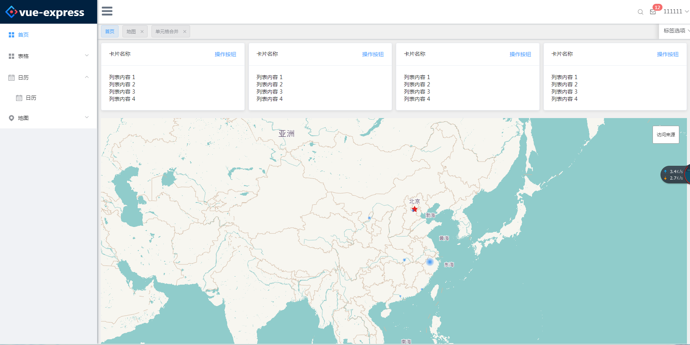
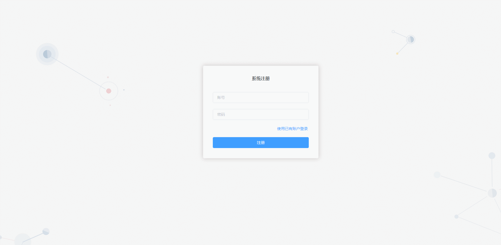

<p align="center">
    <a href="http://59.110.164.162:3000/#/login">
        <img width="200" src="data:image/svg+xml;base64,PD94bWwgdmVyc2lvbj0iMS4wIiBlbmNvZGluZz0iVVRGLTgiIHN0YW5kYWxvbmU9Im5vIj8+Cjxzdmcgd2lkdGg9IjIwMHB4IiBoZWlnaHQ9IjIwMHB4IiB2aWV3Qm94PSIwIDAgMjAwIDIwMCIgdmVyc2lvbj0iMS4xIiB4bWxucz0iaHR0cDovL3d3dy53My5vcmcvMjAwMC9zdmciIHhtbG5zOnhsaW5rPSJodHRwOi8vd3d3LnczLm9yZy8xOTk5L3hsaW5rIj4KICAgIDwhLS0gR2VuZXJhdG9yOiBTa2V0Y2ggNDcuMSAoNDU0MjIpIC0gaHR0cDovL3d3dy5ib2hlbWlhbmNvZGluZy5jb20vc2tldGNoIC0tPgogICAgPHRpdGxlPkdyb3VwIDI4IENvcHkgNTwvdGl0bGU+CiAgICA8ZGVzYz5DcmVhdGVkIHdpdGggU2tldGNoLjwvZGVzYz4KICAgIDxkZWZzPgogICAgICAgIDxsaW5lYXJHcmFkaWVudCB4MT0iNjIuMTAyMzI3MyUiIHkxPSIwJSIgeDI9IjEwOC4xOTcxOCUiIHkyPSIzNy44NjM1NzY0JSIgaWQ9ImxpbmVhckdyYWRpZW50LTEiPgogICAgICAgICAgICA8c3RvcCBzdG9wLWNvbG9yPSIjNDI4NUVCIiBvZmZzZXQ9IjAlIj48L3N0b3A+CiAgICAgICAgICAgIDxzdG9wIHN0b3AtY29sb3I9IiMyRUM3RkYiIG9mZnNldD0iMTAwJSI+PC9zdG9wPgogICAgICAgIDwvbGluZWFyR3JhZGllbnQ+CiAgICAgICAgPGxpbmVhckdyYWRpZW50IHgxPSI2OS42NDQxMTYlIiB5MT0iMCUiIHgyPSI1NC4wNDI4OTc1JSIgeTI9IjEwOC40NTY3MTQlIiBpZD0ibGluZWFyR3JhZGllbnQtMiI+CiAgICAgICAgICAgIDxzdG9wIHN0b3AtY29sb3I9IiMyOUNERkYiIG9mZnNldD0iMCUiPjwvc3RvcD4KICAgICAgICAgICAgPHN0b3Agc3RvcC1jb2xvcj0iIzE0OEVGRiIgb2Zmc2V0PSIzNy44NjAwNjg3JSI+PC9zdG9wPgogICAgICAgICAgICA8c3RvcCBzdG9wLWNvbG9yPSIjMEE2MEZGIiBvZmZzZXQ9IjEwMCUiPjwvc3RvcD4KICAgICAgICA8L2xpbmVhckdyYWRpZW50PgogICAgICAgIDxsaW5lYXJHcmFkaWVudCB4MT0iNjkuNjkwODE2NSUiIHkxPSItMTIuOTc0MzU4NyUiIHgyPSIxNi43MjI4OTgxJSIgeTI9IjExNy4zOTEyNDglIiBpZD0ibGluZWFyR3JhZGllbnQtMyI+CiAgICAgICAgICAgIDxzdG9wIHN0b3AtY29sb3I9IiNGQTgxNkUiIG9mZnNldD0iMCUiPjwvc3RvcD4KICAgICAgICAgICAgPHN0b3Agc3RvcC1jb2xvcj0iI0Y3NEE1QyIgb2Zmc2V0PSI0MS40NzI2MDYlIj48L3N0b3A+CiAgICAgICAgICAgIDxzdG9wIHN0b3AtY29sb3I9IiNGNTFEMkMiIG9mZnNldD0iMTAwJSI+PC9zdG9wPgogICAgICAgIDwvbGluZWFyR3JhZGllbnQ+CiAgICAgICAgPGxpbmVhckdyYWRpZW50IHgxPSI2OC4xMjc5ODcyJSIgeTE9Ii0zNS42OTA1NzM3JSIgeDI9IjMwLjQ0MDA5MTQlIiB5Mj0iMTE0Ljk0MjY3OSUiIGlkPSJsaW5lYXJHcmFkaWVudC00Ij4KICAgICAgICAgICAgPHN0b3Agc3RvcC1jb2xvcj0iI0ZBOEU3RCIgb2Zmc2V0PSIwJSI+PC9zdG9wPgogICAgICAgICAgICA8c3RvcCBzdG9wLWNvbG9yPSIjRjc0QTVDIiBvZmZzZXQ9IjUxLjI2MzUxOTElIj48L3N0b3A+CiAgICAgICAgICAgIDxzdG9wIHN0b3AtY29sb3I9IiNGNTFEMkMiIG9mZnNldD0iMTAwJSI+PC9zdG9wPgogICAgICAgIDwvbGluZWFyR3JhZGllbnQ+CiAgICA8L2RlZnM+CiAgICA8ZyBpZD0iUGFnZS0xIiBzdHJva2U9Im5vbmUiIHN0cm9rZS13aWR0aD0iMSIgZmlsbD0ibm9uZSIgZmlsbC1ydWxlPSJldmVub2RkIj4KICAgICAgICA8ZyBpZD0ibG9nbyIgdHJhbnNmb3JtPSJ0cmFuc2xhdGUoLTIwLjAwMDAwMCwgLTIwLjAwMDAwMCkiPgogICAgICAgICAgICA8ZyBpZD0iR3JvdXAtMjgtQ29weS01IiB0cmFuc2Zvcm09InRyYW5zbGF0ZSgyMC4wMDAwMDAsIDIwLjAwMDAwMCkiPgogICAgICAgICAgICAgICAgPGcgaWQ9Ikdyb3VwLTI3LUNvcHktMyI+CiAgICAgICAgICAgICAgICAgICAgPGcgaWQ9Ikdyb3VwLTI1IiBmaWxsLXJ1bGU9Im5vbnplcm8iPgogICAgICAgICAgICAgICAgICAgICAgICA8ZyBpZD0iMiI+CiAgICAgICAgICAgICAgICAgICAgICAgICAgICA8cGF0aCBkPSJNOTEuNTg4MDg2Myw0LjE3NjUyODIzIEw0LjE3OTk2NTQ0LDkxLjUxMjc3MjggQy0wLjUxOTI0MDYwNSw5Ni4yMDgxMTQ2IC0wLjUxOTI0MDYwNSwxMDMuNzkxODg1IDQuMTc5OTY1NDQsMTA4LjQ4NzIyNyBMOTEuNTg4MDg2MywxOTUuODIzNDcyIEM5Ni4yODcyOTIzLDIwMC41MTg4MTQgMTAzLjg3NzMwNCwyMDAuNTE4ODE0IDEwOC41NzY1MSwxOTUuODIzNDcyIEwxNDUuMjI1NDg3LDE1OS4yMDQ2MzIgQzE0OS40MzM5NjksMTU0Ljk5OTYxMSAxNDkuNDMzOTY5LDE0OC4xODE5MjQgMTQ1LjIyNTQ4NywxNDMuOTc2OTAzIEMxNDEuMDE3MDA1LDEzOS43NzE4ODEgMTM0LjE5MzcwNywxMzkuNzcxODgxIDEyOS45ODUyMjUsMTQzLjk3NjkwMyBMMTAyLjIwMTkzLDE3MS43MzczNTIgQzEwMS4wMzIzMDUsMTcyLjkwNjAxNSA5OS4yNTcxNjA5LDE3Mi45MDYwMTUgOTguMDg3NTM1OSwxNzEuNzM3MzUyIEwyOC4yODU5MDgsMTAxLjk5MzEyMiBDMjcuMTE2MjgzMSwxMDAuODI0NDU5IDI3LjExNjI4MzEsOTkuMDUwNzc1IDI4LjI4NTkwOCw5Ny44ODIxMTE4IEw5OC4wODc1MzU5LDI4LjEzNzg4MjMgQzk5LjI1NzE2MDksMjYuOTY5MjE5MSAxMDEuMDMyMzA1LDI2Ljk2OTIxOTEgMTAyLjIwMTkzLDI4LjEzNzg4MjMgTDEyOS45ODUyMjUsNTUuODk4MzMxNCBDMTM0LjE5MzcwNyw2MC4xMDMzNTI4IDE0MS4wMTcwMDUsNjAuMTAzMzUyOCAxNDUuMjI1NDg3LDU1Ljg5ODMzMTQgQzE0OS40MzM5NjksNTEuNjkzMzEgMTQ5LjQzMzk2OSw0NC44NzU2MjMyIDE0NS4yMjU0ODcsNDAuNjcwNjAxOCBMMTA4LjU4MDU1LDQuMDU1NzQ1OTIgQzEwMy44NjIwNDksLTAuNTM3OTg2ODQ2IDk2LjI2OTI2MTgsLTAuNTAwNzk3OTA2IDkxLjU4ODA4NjMsNC4xNzY1MjgyMyBaIiBpZD0iU2hhcGUiIGZpbGw9InVybCgjbGluZWFyR3JhZGllbnQtMSkiPjwvcGF0aD4KICAgICAgICAgICAgICAgICAgICAgICAgICAgIDxwYXRoIGQ9Ik05MS41ODgwODYzLDQuMTc2NTI4MjMgTDQuMTc5OTY1NDQsOTEuNTEyNzcyOCBDLTAuNTE5MjQwNjA1LDk2LjIwODExNDYgLTAuNTE5MjQwNjA1LDEwMy43OTE4ODUgNC4xNzk5NjU0NCwxMDguNDg3MjI3IEw5MS41ODgwODYzLDE5NS44MjM0NzIgQzk2LjI4NzI5MjMsMjAwLjUxODgxNCAxMDMuODc3MzA0LDIwMC41MTg4MTQgMTA4LjU3NjUxLDE5NS44MjM0NzIgTDE0NS4yMjU0ODcsMTU5LjIwNDYzMiBDMTQ5LjQzMzk2OSwxNTQuOTk5NjExIDE0OS40MzM5NjksMTQ4LjE4MTkyNCAxNDUuMjI1NDg3LDE0My45NzY5MDMgQzE0MS4wMTcwMDUsMTM5Ljc3MTg4MSAxMzQuMTkzNzA3LDEzOS43NzE4ODEgMTI5Ljk4NTIyNSwxNDMuOTc2OTAzIEwxMDIuMjAxOTMsMTcxLjczNzM1MiBDMTAxLjAzMjMwNSwxNzIuOTA2MDE1IDk5LjI1NzE2MDksMTcyLjkwNjAxNSA5OC4wODc1MzU5LDE3MS43MzczNTIgTDI4LjI4NTkwOCwxMDEuOTkzMTIyIEMyNy4xMTYyODMxLDEwMC44MjQ0NTkgMjcuMTE2MjgzMSw5OS4wNTA3NzUgMjguMjg1OTA4LDk3Ljg4MjExMTggTDk4LjA4NzUzNTksMjguMTM3ODgyMyBDMTAwLjk5OTg2NCwyNS42MjcxODM2IDEwNS43NTE2NDIsMjAuNTQxODI0IDExMi43Mjk2NTIsMTkuMzUyNDQ4NyBDMTE3LjkxNTU4NSwxOC40Njg1MjYxIDEyMy41ODUyMTksMjAuNDE0MDIzOSAxMjkuNzM4NTU0LDI1LjE4ODk0MjQgQzEyNS42MjQ2NjMsMjEuMDc4NDI5MiAxMTguNTcxOTk1LDE0LjAzNDAzMDQgMTA4LjU4MDU1LDQuMDU1NzQ1OTIgQzEwMy44NjIwNDksLTAuNTM3OTg2ODQ2IDk2LjI2OTI2MTgsLTAuNTAwNzk3OTA2IDkxLjU4ODA4NjMsNC4xNzY1MjgyMyBaIiBpZD0iU2hhcGUiIGZpbGw9InVybCgjbGluZWFyR3JhZGllbnQtMikiPjwvcGF0aD4KICAgICAgICAgICAgICAgICAgICAgICAgPC9nPgogICAgICAgICAgICAgICAgICAgICAgICA8cGF0aCBkPSJNMTUzLjY4NTYzMywxMzUuODU0NTc5IEMxNTcuODk0MTE1LDE0MC4wNTk2IDE2NC43MTc0MTIsMTQwLjA1OTYgMTY4LjkyNTg5NCwxMzUuODU0NTc5IEwxOTUuOTU5OTc3LDEwOC44NDI3MjYgQzIwMC42NTkxODMsMTA0LjE0NzM4NCAyMDAuNjU5MTgzLDk2LjU2MzYxMzMgMTk1Ljk2MDUyNyw5MS44Njg4MTk0IEwxNjguNjkwNzc3LDY0LjcxODExNTkgQzE2NC40NzIzMzIsNjAuNTE4MDg1OCAxNTcuNjQ2ODY4LDYwLjUyNDE0MjUgMTUzLjQzNTg5NSw2NC43MzE2NTI2IEMxNDkuMjI3NDEzLDY4LjkzNjY3NCAxNDkuMjI3NDEzLDc1Ljc1NDM2MDcgMTUzLjQzNTg5NSw3OS45NTkzODIxIEwxNzEuODU0MDM1LDk4LjM2MjM3NjUgQzE3My4wMjM2Niw5OS41MzEwMzk2IDE3My4wMjM2NiwxMDEuMzA0NzI0IDE3MS44NTQwMzUsMTAyLjQ3MzM4NyBMMTUzLjY4NTYzMywxMjAuNjI2ODQ5IEMxNDkuNDc3MTUsMTI0LjgzMTg3IDE0OS40NzcxNSwxMzEuNjQ5NTU3IDE1My42ODU2MzMsMTM1Ljg1NDU3OSBaIiBpZD0iU2hhcGUiIGZpbGw9InVybCgjbGluZWFyR3JhZGllbnQtMykiPjwvcGF0aD4KICAgICAgICAgICAgICAgICAgICA8L2c+CiAgICAgICAgICAgICAgICAgICAgPGVsbGlwc2UgaWQ9IkNvbWJpbmVkLVNoYXBlIiBmaWxsPSJ1cmwoI2xpbmVhckdyYWRpZW50LTQpIiBjeD0iMTAwLjUxOTMzOSIgY3k9IjEwMC40MzY2ODEiIHJ4PSIyMy42MDAxOTI2IiByeT0iMjMuNTgwNzg2Ij48L2VsbGlwc2U+CiAgICAgICAgICAgICAgICA8L2c+CiAgICAgICAgICAgIDwvZz4KICAgICAgICA8L2c+CiAgICA8L2c+Cjwvc3ZnPg==">
    </a>
</p>

# vue-express
[](https://travis-ci.org/iview/iview-admin)
[](https://github.com/vuejs/vue)
[]()


## 当前版本：v1.0.0
<!-- [更新日志](https://github.com/iview/iview-admin/releases) -->

<!-- [使用教程](https://github.com/iview/iview-admin/wiki) -->

[在线访问](http://59.110.164.162:3000/#/login)

<!-- [English Doc](https://github.com/iview/iview-admin/blob/dev/README_EN.md) -->

<!-- [简化版模板](https://github.com/iview/iview-admin/tree/template) -->

<!-- `注：在线版本会在开发版本新小版本发布后更新到相应版本，所以如果想体验最新版本iview-admin，请clone完整项目代码到本地运行。` -->

<!-- ## 2.0版本预告 Feature 
`2.0版本现已公测，可以从2.0分支clone到本地，更多组件正在开发中.`

`Version 2.0 is now open beta, can be cloned from the 2.0 branch to the local, more components are under development.`

- Webpack4 + Vue-cli3.0
- 重整项目结构，更好封装组件
- 新增更多组件
- 多级菜单
- 动态路由
- 重构权限控制体系
- 使用最新版iView以及iView-editor
- 加入大数据量表格[vue-bigdata-table](https://github.com/lison16/vue-bigdata-table)组件，几十万数据流畅渲染
- ...... -->

## Install
```bush
// install dependencies
npm install
```
## Run
### Development
```bush
npm run dev
```

### Production(Build)
```bush
npm run build
`注：dist文件夹拷贝到public`
```

## 简介
&emsp;&emsp;vue-express是基于Vue.js、express，搭配使用[element](http://element-cn.eleme.io/#/zh-CN) UI组件库形成的一套后台集成解决方案。功能在完善中...

## 功能

- 注册/登录
- 表格
    - 单元格合并
    - 可拖拽排序
    - 表格树
- 日历

<!-- ## 文件结构
```shell
.
├── build  项目构建配置
└── src
    ├── images  图片文件
    ├── libs  工具方法
    ├── locale  多语言文件
    ├── router  路由配置
    ├── store  状态管理
    ├── styles  样式文件
    ├── template  模板文件
    ├── vendors  公共库文件
    └── views
        ├── access  权限管理
        ├── advanced-router  高级路由
        ├── error_page  错误页面
        ├── form  表单编辑
        ├── home  首页
        │   ├── components  首页组件
        ├── international  多语言
        ├── main_components  Main组件
        │   ├── lockscreen  锁屏
        │   ├── shrinkable-menu  可收缩菜单
        │   └── theme-switch  主题切换
        ├── message  消息中心
        ├── my_components  业务组件
        │   ├── area-linkage  中国行政区级联选择器
        │   ├── count-to  数字渐变
        │   ├── draggable-list  可拖拽列表
        │   ├── file-upload  文件上传
        │   ├── image-editor  图片预览编辑
        │   ├── markdown-editor  Markdown编辑器
        │   └── text-editor  富文本编辑器
        ├── own-space  个人中心
        └── tables  综合表格
``` -->

<!-- ## Links

- [TalkingData](https://github.com/TalkingData)
- [iView](https://github.com/iview/iview)
- [Vue](https://github.com/vuejs/vue)
- [Webpack](https://github.com/webpack/webpack) -->

## 效果展示

- 响应式布局首页


- 登录/注册

<!-- -
- 权限管理


- 可拖拽列表


- 图片预览编辑


- 文件上传


- 数字渐变


- split-pane


- 文章发布


- 工作流


- 可拖拽表格


- 可编辑表格


- 表格导出数据


- 表格转图片


- 错误页面


- 锁屏


- 可收缩侧边栏


- 主题切换


- 消息中心
 -->

<!-- ### 💖💖 If you find this project helpful, maybe you can buy me a coffee. 💖💖
 -->


<!-- ## License
[MIT](http://opensource.org/licenses/MIT)

Copyright (c) 2016-present, iView -->
